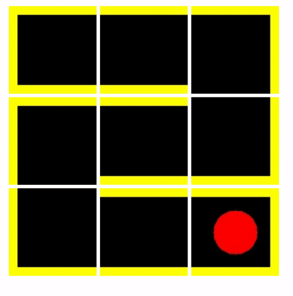
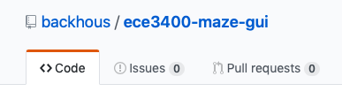

# ECE 3400: Maze GUI

For the third lab, you will incorporate a second Arduino into your system. This will allow your robot to send information as it explores to a graphical user interface (GUI) which will then display to you what your robot learns about the maze.

For clarity, we will refer to second Arduino this as the _Base Station Arduino_ and to the Arduino on your robot as the _Robot Arduino_. The Robot Arduino will communicate wirelessly with the Base Station Arduino while your robot explores a maze, sending information about the maze's layout and contents. The Base Station Arduino will communicate with the Maze GUI over a serial connection mediated by a USB cable connecting the Base Station Arduino to a PC running the Maze GUI software. 

This document describes the interface you must implement so that the Maze GUI will understand the messages sent by the Base State Arduino.

---

### Installation / Setup:

You will need Python 2.7 installed on your system to use the maze GUI. You will also need a Python package manager called `pip`.

- [Instructions for installing these on Windows.](https://github.com/BurntSushi/nfldb/wiki/Python-&-pip-Windows-installation)
- [Instructions for installing these on Mac OS X.](https://stackoverflow.com/questions/17271319/how-do-i-install-pip-on-macos-or-os-x)
- Instructions for installing these on Linux are not provided as if you use Linux you already know how to do this.

You can run the Maze GUI by cloning this repository. Notice there is a file included called `requirements.txt`. This file details the Python packages necessary to run the GUI. You can install these packages by navigating your command prompt or terminal to the folder containing this file and running:
`pip install -r requirements.txt` 

---

### Launching the GUI:

Before launching the GUI, plug in your Arduino. This repository includes two test scripts in the `/arduino` folder. It will be helpful for testing if you program your Arduino with one of these before trying to launch the GUI.

The GUI is run using the terminal. After navigating your command prompt or terminal to the folder containing `main.py`, launch the GUI by entering the command:  
`python main.py <PORT> --rows <ROWS> --cols <COLS>`

- Replace `<PORT>` with the value you find in the Tools > Port menu in your Arduino IDE. Note: If you are using Mac OS X or Linux, you will need to add `/dev/` before this value. See the example below.

- Replace `<ROWS>` with the number of rows in your maze.

- Replace `<COLS>` with the number of columns in your maze.

As an example, on my machine (running Mac OS X), I can start the GUI with the following command:  
`python main.py /dev/tty.wchusbserial141110 --rows 2 --cols 3`

When the GUI starts, it will attempt to connect to the Arduino and then open a web browser that will display the current state of the maze. If you programmed your Arduino with one of the test programs found in `/arduino`, you should see the maze updating as the Arduino sends in messages.

---

### Reporting Bugs:

GitHub includes a useful feature for reporting bugs or problems with a repository called Issues. If you navigate your browser to the GitHub page for the Maze GUI (the page you are probably on right now), you can submit an issue by clicking the __Issues__ link near the top of the page.

Please use this feature to report any bugs you encounter. This is the first time in ECE 3400 that we are using this GUI setup, so we fully expect you to discover problems.

---

### Message Format:

The Arduino will send a message to the GUI just as it prints data to the 
serial monitor of the Arduino IDE. For example:

`Serial.println("0,0,west=true,north=true")`

This message means that at the maze coordinates `(0, 0)` there is a wall to the
west and a wall to the north. Maze positions are referenced using 
*raster coordinates*, so the upper left corner of the maze has coordinates
`(0, 0)`.

___The GUI will only process a message that ends with a newline.___ For this
reason, you should use `Serial.println` not `Serial.print` to send messages. 
However, the latter can be used as long as you manually insert a newline `\n` at
end of your message.

You can include as few as zero or infinitely many (not recommended for 
performance reasons) parameters after specifiying the row and column coordinates 
at the beginning of the message.

All of the following are legal messages:

`1,0,north=true`

`2,3,west=false,north=true,south=false`

`0,0,west=false,west=true`

Note that the last message sets the value of `west` twice. The GUI will only
process the *final* value of `west` sent in the message. `true`, in this 
case.

---

### Parameters:
There are eight parameters you can set for each cell in the maze. Each parameter has a limited set of allowed values. The default value is shown in the table below. All cells start with the default value set for each parameter. For this reason, you do not not need to inform the GUI about the absence of walls or the absence of treasures, etc. Note that capitalization does not matter. The GUI will treat all messages as lowercase.

There is a special parameter called `iamhere`. When this parameter is set to `True`, the GUI will show an icon at the given coordinates indicating the presence of your robot. ___You do not need to set this parameter, as the GUI will automatically assume that your robot is at the position you are describing.___ However, if you do not want this to happen, you must specify `iamhere` as `False`. This will allow you to describe maze locations where your robot is not present.

|Parameter   |Allowed Values   |Default   |Description|
|---|---|---|---|
|iamhere|True, False|False|Is your robot at this position? __Note: This is a special parameter. See details above.__|
|west   |True, False   |False   |Is a wall to the west?|
|north   |True, False   |False   |Is a wall to the north?|
|east   |True, False   |False   |Is a wall to the east?|
|south   |True, False   |False   |Is a wall to the south?|
|robot   |True, False   |False   |Is another robot present?|
|tshape   |Circle, Triangle, Square, None   |None   |What shape treasure is present?|
|tcolor   |Red, Green, Blue, None   |None   |What color treasure is present?|
