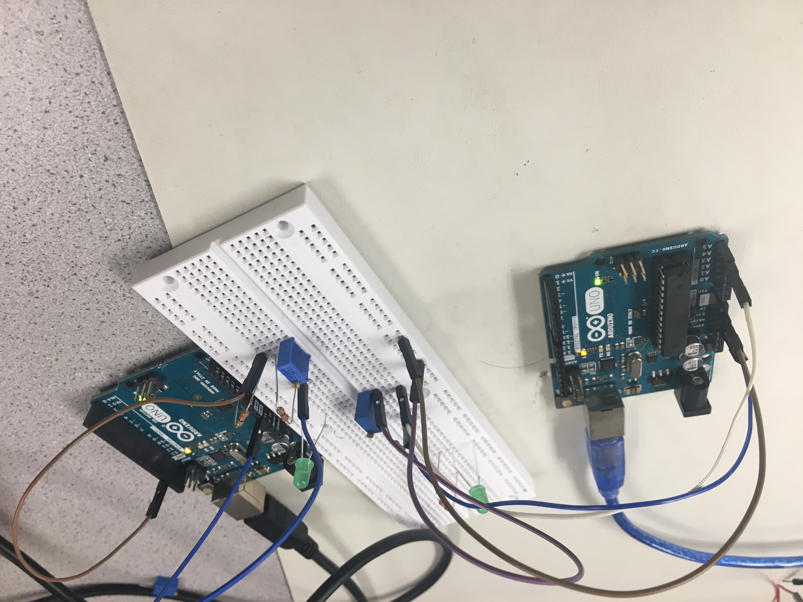
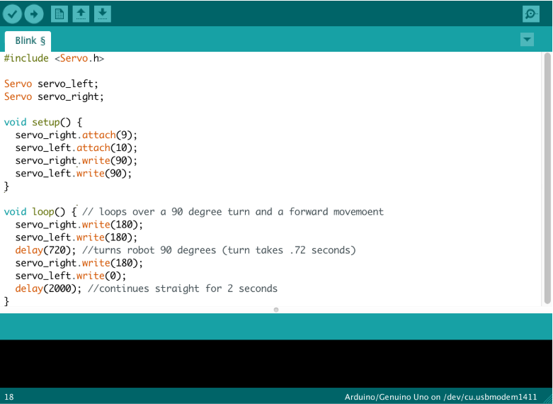

# Lab 1 Report

## Introduction

The purpose of this lab was to familiarize ourselves with the functionalities of the Arduino Uno and IDE, as well as assemble our robot. We did this via writing a simple functional Arduino program using external components along with the Arduino Uno.

## Lab Implementation

Utilizing the [Arduino IDE](https://www.arduino.cc/en/Main/Software), we were able to make the Uno’s onboard LED blink using an example sketch found under File > Examples > 1.Basics > Blink.

### Blinking the LEDs
 

We then moved on to blinking an external LED, so we connected an LED to the Uno with a ~300Ω resistor in series to help prevent voltages over ~5V from damaging the Uno.

This is the code we used to blink the external LED, starting with the same base Blink sketch but changing the output pin from LED_BUILTIN to pin 0. Writing HIGH or LOW to pin 0 directed the LED to turn on and off, respectively.

### Reading and Printing Potentiometer Serial Data

Now we want to read an analog value from a potentiometer hooked up to one of the analog pins on the Uno.

The code we used to read from the potentiometer first declared pin A0 as an input and used the Serial.begin() function to set a bit rate in order to send serial data. We then set up a loop in which the analogRead() and Serial.println() functions read the incoming serial data and print it to the serial monitor. Since we want to sample every 0.5 seconds, there is an added delay() of 500 ms in the loop.

### Mapping Values from Potentiometer to LED

The range of values read from the potentiometer [0, 1024] is four times the range of values able to be written to the LED [0, 255]. In order to be fed to the LED output pin, the serial data read from the potentiometer is divided by four.

### Mapping Values from Potentiometer to Servo

In order to scale the potentiometer range [0, 1024] to the servo range [0, 180], we multiplied the input by 180/1024.

### Assembly and Autonomous Driving

The design of our robot was very simplistic. It had a flat top as its body where the Uno and breadboard rested and servos connected to wheels on either side of it. To balance, it had a leg on the front with a ball bearing on the bottom to reduce friction against the floor. Brackets were screwed underneath the body to hold the 5V battery pack.

Movement around a square can be broken down into two components: moving forward and turning 90 degrees. To direct the bot to move forward, the right servo rotates clockwise and the left servo rotates counterclockwise. To complete a 90 degree turn, both servos are set to rotate clockwise so that the right wheel moves forward and the left wheel moves backwards, turning to the left. Through testing we found that a 90 degree turn took about 0.72 seconds so a delay of 720 ms was added. The size of the square path is set by the duration that the robot is directed to move forwards, in this case two seconds.

