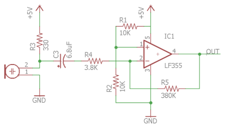
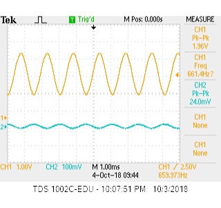
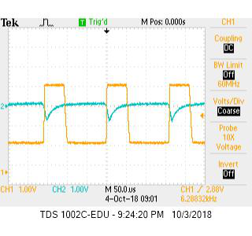

# Lab 2 Report

## Introduction
In this lab we added sensors and signal processing to our robot. We first added a microphone to detect 660 Hz audio signals. Then, we added an IR sensor to detect other robots emitting IR at 6.08kHz. We processed the signals using the Arduino FFT Library. Also, we made 2 amplifiers to detect the signals from a farther distance. Finally, using a digital filter, we were able to ignore the decoys that emit IR at 18kHz.

## Implementation
*Insert FFT Analysis*

Our Logic:
Since we wanted to analyze signals from two sources, we had to switch which pin out we were reading data from on the arduino. We read audio from A0 and IR from A1. We made this switch in the while loop switching ADMUX back and forth from 0x40 to 0x41 (switching from A0 to A1). We checked determine which signal we were reading, we checked which pin we were reading from and then we checked 

Amplifier Schematic:
Pretty quickly, we realized that the we would only be able to recognize both the audio and IR signal from very close distances (less than 3 inches). Since during the competition we would need to identify both sound and IR coming from a farther away than our current abilities, we made two amplifiers to amplify both the audio and IR signals. We used the same amplifier as Team Alpha. Here is the schematic of the amplifier:

Here is a picture of our assembled amplifier:
*insert amp pic*

Before we used either amplifier with the audio or IR signals, we tested both of them and measured the gain. Inputting a small signal on a signal generator, we were able to have a gain of ___ and ___ for the two amplifiers. Here is an oscilloscope screenshot showing the gain:

## Testing
We first tested the audio and IR signals individually. To test the both the audio and IR signals individually, we checked the expected bin of the signal. If the bin magnitude was above a certain amplitude, we turned an LED on, indicating that we were receiving a signal. Similarly, if we did not see the bin value at a high enough value, we turned the LED off. Here is a video of testing the audio sensors:

//

To test that we could distinguish between a robot and the decoy, we set up an LED to indicate if the we were receiving a 6.08 kHz IR signal. If we were receiving a 18 kHz IR signal, we do nothing. Both the robot hat and the decoy were powered on a moving toward and away from the robot and our system successfully never turned on the LED due to the decoy, but only due to the robot hat.

To test the combined system, we added a second LED, one to indicate we were receiving audio and one to indicate we were receiving IR. Here is the video of testing the single system.

