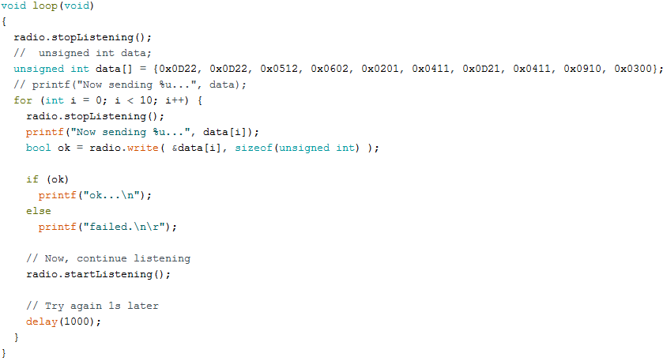

# Lab 3 Report

## Introduction
In this lab, we integrated many of the components we had working in the previous labs (including IR sensor, audio sensor, line sensors, and wall sensors) to have our robot start tracking the maze after a 660 Hz tone. Additionally, our robot sent information wirelessly to a base station which displayed the information on the screen using a GUI.  

## Starting on a 660 Hz Tone 

The first thing we did was to start the robot once a 660 Hz tone is played. To do this, we used our code from lab 2 and we also added a variable detects_audio that indicates if we have heard the signal or not. Our code is below.

## Starting on a 660 Hz Tone and exploring the entire maze  

To implement this with out full code, we used a spin lock that would only allow the robot to start traversing the maze once the tone was played. In this code, we loop while we have not yet heard the audio signal. In the loop we check for the audio signal.

One problem we had with this was that powering the wall sensors with the same power as the amplifier that power the microphone signal caused a lot of noise that prevented us from distinguishing the 660 Hz tone from noise. To fix this, we add a second power source just to power the audio signal amplifier.

### The below video shows the robot starting on a 660Hz tone and exploring the entire maze and changing a path if it sees another robot and ignoring the Decoys.
 
<iframe width="560" height="315" src="https://www.youtube.com/embed/cb1B5bx-IMQ" frameborder="0" allow="autoplay; encrypted-media" allowfullscreen></iframe>

## Data Scheme for Storing Information
The data scheme involved defining a protocol for storage on the Robot and transfer of maze information from the robot to the base station. 
We tried to minimize the size of the data type in this protocol by defining most of the information on bit level. 
This helps in 2 aspects:   
* (i) Memory requirement to store the data is less. 
* (ii) Data size is less, hence processing will be faster and hence helps to decrease latency during data transmission.

Our Data Protocol was something as below.

### Nibble 1 
[0:3] - Robot x co-ordinate (Range is 0-8 since its a 9x9 matrix) 

### Nibble 2 
[4:7] - Robot y co-ordinate (Range is 0-8 since its a 9x9 matrix) 

### Nibble 3
[8] - West Wall(0:no wall; 1:wall exists) 

[9] - North Wall(0:no wall; 1:wall exists) 

[10] - East Wall(0:no wall; 1:wall exists) 

[11] - South Wall(0:no wall; 1:wall exists)

### Nibble 4
[12:14] - Treasure Type (Predetermined treasure type codes as below) 

No Treasure = 0

Blue Triangle = 1 | Blue Square = 2 | Blue Diamond = 3

Red Triangle = 4 | Red Square = 5 | Red Diamond = 6 

[15] - Opponent Robot ( 0 - no Robot exists ; 1 - Robot obstructing path ) 

By this, we are able to send all the data using just 2 bytes of which can be easily stored as an integer. If we want to introduce a “data data_bar” scheme for more redundancy for data correction, we can still implement the whole protocol in an unsigned long. But the data was pretty clean over the channel, so we did not care to implement more redundancy.  

## Sending Information Wirelessly Between Arduinos
In order to get the Arduinos to communicate wirelessly using the RF chips, we studied and experimented with the given GettingStarted.ino file to find out which parts were necessary to transmit and receive information and which parts were extraneous to our objective for this lab. The configuration settings in our code were drawn heavily from the given configuration settings, with the only changes being an increased power and data rate and a decreased payload size for more reliability. Since the robot was always sending information and the base station was always receiving it, we found the role switching capabilities of the original code to be unnecessary. Both pipes for reading and writing were set from the beginning and we found no need for the base station to send information for the robot to receive beyond an acknowledgment of a successfully received message. As a result, the final RF code used for this lab was significantly cut down in length while still remaining functional.

## Updating the GUI from Base Station
GUI is one of the visualization aspects of any project to make the product more user-friendly or to visualize data better, and in this project is being used for the later. The setup involved setting up a couple of python libraries and running a pre-coded configurable(can be configured to set Robot Positions, a maze which pops up on the local browser to display the robot/maze information. 
The process was familiarized by a set of default serial prints by Arduino to the serial port which can be converted to GUI on a web browser.

## Updating the GUI from a virtual robot on a separate Arduino which is wirelessly connected to the base station.

Once the robot sends the base station a message with all of the information encoded in the format described above, the base station decodes the message with the use of masking and bit shifting in order to extract information from specific bits. The base station iterates over the bits of the message and prints (without newlines) the information contained within them. For example, if our robot detects another robot, bit 15 will be set to 1 and the base station will print “,robot=true”. Once the message has been fully parsed and interpreted, it prints a new line so that the GUI will receive the information and update accordingly. To ensure our communication protocol works as intended, we created a random 3x3 maze and queued up the messages a virtual robot would send if it traversed the maze.

 
 

The video below shows a video of data transmission from Arduino1 → Arduino 2 and Arduino2 using the same to display it on the GUI. 

### Demo of robot-to-gui integration
<iframe width="560" height="315" src="https://www.youtube.com/embed/FKI-ZMED-DY" frameborder="0" allow="autoplay; encrypted-media" allowfullscreen></iframe>

### Screen recording of GUI
<iframe width="560" height="315" src="https://www.youtube.com/embed/kc94y1iIkes" frameborder="0" allow="autoplay; encrypted-media" allowfullscreen></iframe>  

## Mapping the Maze
We set up the following the maze and ran our robot through it, sending maze information to the base station at every intersection.

## Final demo of robot exploring the test maze and sending observations to base

<iframe width="560" height="315" src="https://www.youtube.com/embed/b-ZRW0ASdzc" frameborder="0" allow="autoplay; encrypted-media" allowfullscreen></iframe>

The following video shows the information the base station received from the robot. It is in the format that is required for the maze GUI to update properly. Each line accurately represents the robot's observations on each tile of the maze, as a whole describing the size and wall positions of the entire test maze. The robot started in the top left corner of the maze (0, 0) while facing downwards.

<iframe width="560" height="315" src="https://www.youtube.com/embed/qwj-zpVfnow" frameborder="0" allow="autoplay; encrypted-media" allowfullscreen></iframe>
