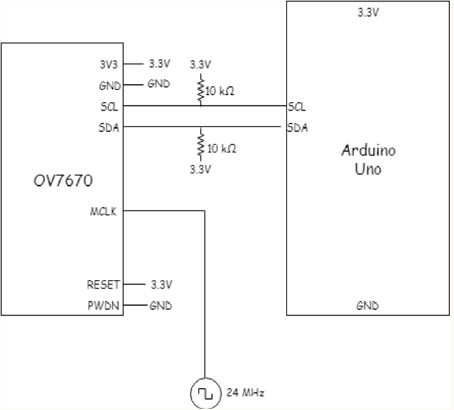
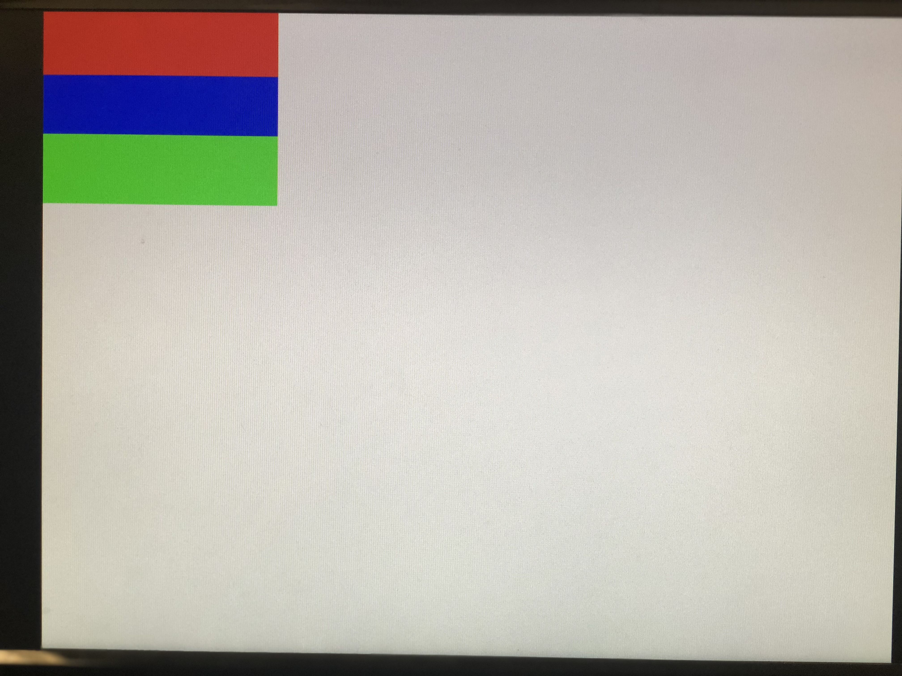
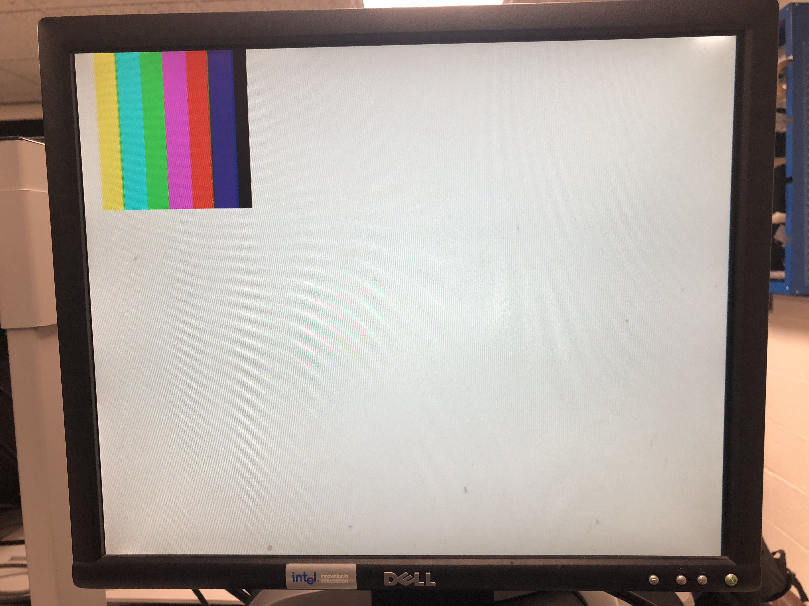

# Lab 4 Report

## Introduction
In this lab, we interfaced the OV7670 camera with the FPGA, established communication between the FPGA and Arduino and also implemented color detection on the FPGA to differentiate red and blue colors. 


## Arduino-Camera Communication
We used I2C communication from the Arduino to set registers on the camera. The camera registers configure the camera as per the requirements. 
We set up the I2C communication as below.



The 24MHz signal is taken from the PLL set up on the FPGA. 

We used the registers provided in the Arduino template and also some extra registers as below required for the task. 


```
OV7670_write_register(0x11, 0xC0); //use external clock directly
OV7670_write_register(0x1E, 0x30); //mirror and Vertical Flip
OV7670_write_register(0x0C, 0x08); //scale enable
OV7670_write_register(0x12, 0x0C); //RGB output
OV7670_write_register(0x40, 0xD0); //RGB565 format
OV7670_write_register(0x42, 0x00); //reset DSP bar 
```


To make sure the registers are set we read the registers before setting and after setting to make sure the registers are actually changing. 
 
```
Serial.println("Before Setting");
read_key_registers();

set_color_matrix();

Serial.println("After Setting");
read_key_registers();
```

## Arduino-FPGA Communication
For the communication between the Arduino and FPGA, we followed the same protocol we had set up for the radio communication between the Arduino. Since we had sense fixed number of conditions, the protocol used is as below. 

No Treasure = 000;

Blue Triangle = 001; 	Blue Square = 010;	 Blue Diamond = 011;

Red Triangle = 100; 	Red Square = 101; 	 Red Diamond = 110;
 
We used 3 GPIO pins to communicate between the FPGA and the Arduino.


## Displaying Image in M9K Block
The display is VGA compatible, to display the content in the FPGA we need to connect a VGA connector to GPIO pins.
In order to test displaying the content of the memory on the screen, we first wrote a test image of 3 horizontal bars of varying color into the memory with the following code:


```
always @ (VGA_PIXEL_X, VGA_PIXEL_Y) begin
		//READ_ADDRESS = (VGA_PIXEL_X + VGA_PIXEL_Y*`SCREEN_WIDTH);
		if( VGA_PIXEL_Y<(48))begin
				pixel_data_RGB332 = RED ;
		end
		else if(VGA_PIXEL_Y<(92)) begin
				pixel_data_RGB332 = BLUE ;

		end
		else begin
				pixel_data_RGB332 = GREEN ;

		end
end
```


To unit test the code first we directly used the input in the VGA module. 

```
.PIXEL_COLOR_IN(VGA_READ_MEM_EN ? pixel_data_RGB332 : WHITE)
```

Next, we had to test the memory module, in order to read dynamically i.e to update the read address images onto the screen with every pixel in the correct position, it was required to make use of the HREF and VSYNC signals from the camera to recognize the end of the line and end of a frame.

```
.PIXEL_COLOR_IN(VGA_READ_MEM_EN ? MEM_OUTPUT : WHITE)
```




## Camera-FPGA Communication
For communication between the camera and FPGA we need to connect the camera outputs to the FPGA. 
D0-D7 -  Image data transmission.
HREF - to indicate the end of the line 
VSync - to indicate the end of the frame. 

Colour bar 
For the color bar test, we had to have special settings. We used below register configuration for color bar output.

```
OV7670_write_register(0x11, 0xC0);
OV7670_write_register(0x1E, 0x30);
OV7670_write_register(0x0C, 0x08);
OV7670_write_register(0x12, 0x0D);
OV7670_write_register(0x40, 0xD0);
OV7670_write_register(0x42, 0x80);

```




## Displaying Camera Image on Screen
The two main things we need to consider for the communication are 
(i) The output of the camera is in RGB565 format - 2 bytes of data
(ii) The input to the VGA is RGB332 - 1 byte of data
Based on the above observations we need to downsample the data i.e we need to selectively choose bits from RGB565 and feed it to RGB332.
The code that downsamples is below. In two cycles, we selected the most significant bits from each color and assigned them to the appropriate bits in RGB332. Each time PCLK is high, a new byte is being sent so at each rising edge of PCLK, if HREF is high, we read the byte and flip the variable that says which bits of RGB332 we write to the next time we read a byte. 

```
Input Byte	7	6	5	4	3	2	1	0	7	6	5	4	3	2	1	0
RGB565		R4	R3	R2	R1	R0	G5	G4	G3	G2	G1	G0	B4	B3	B2	B1	B0
RGB332		R2	R1	R0			G2	G1	G0				B1	B0			
Output Byte	7	6	5			4	3	2				1	0			
```

We also need to re-set color bar registers to get the camera to display the video output.

<iframe width="560" height="315" src="https://www.youtube.com/embed/rwDhzu6AJvo" frameborder="0" allow="accelerometer; autoplay; encrypted-media; gyroscope; picture-in-picture" allowfullscreen></iframe>

## Color Detection
For color detection, we have 2 colors to detect, red and blue.
For color detection, we did not make use of the image processor block, instead, during the 2 cycles of the RGB565 we sample out 4 bits of Red and 4 bits of Blue and add the values sampled to 2 counters which store red and blue, we called them countRed and countBlue. 

At the end of the frame ( when VSync goes high), we compare the counts to the threshold and decide which color is present. The decision is output to a GPIO pin which can be seen on an oscilloscope or sent to an Arduino. 
On the negative edge of VSync, we reset the result, countRed and countBlue for the next frame.


The below video shows detection of Red color on an oscilloscope.

<iframe width="560" height="315" src="https://www.youtube.com/embed/-61CGE04P9I" frameborder="0" allow="accelerometer; autoplay; encrypted-media; gyroscope; picture-in-picture" allowfullscreen></iframe>


