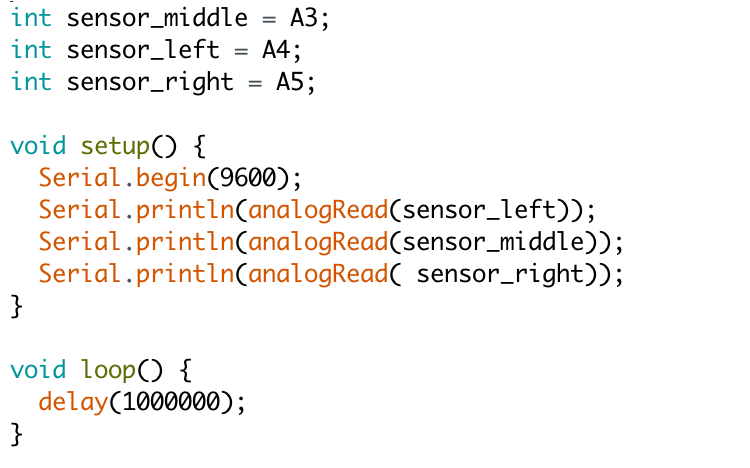
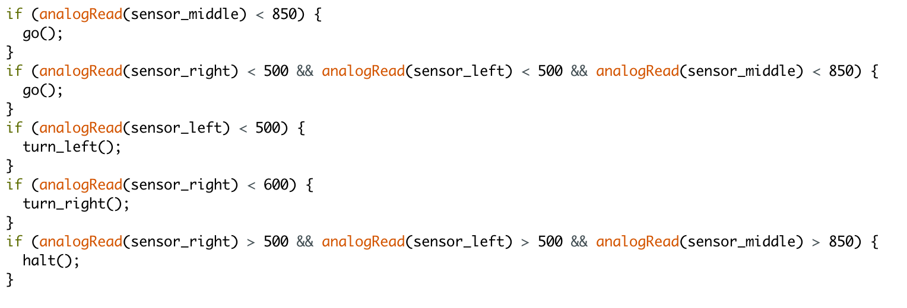
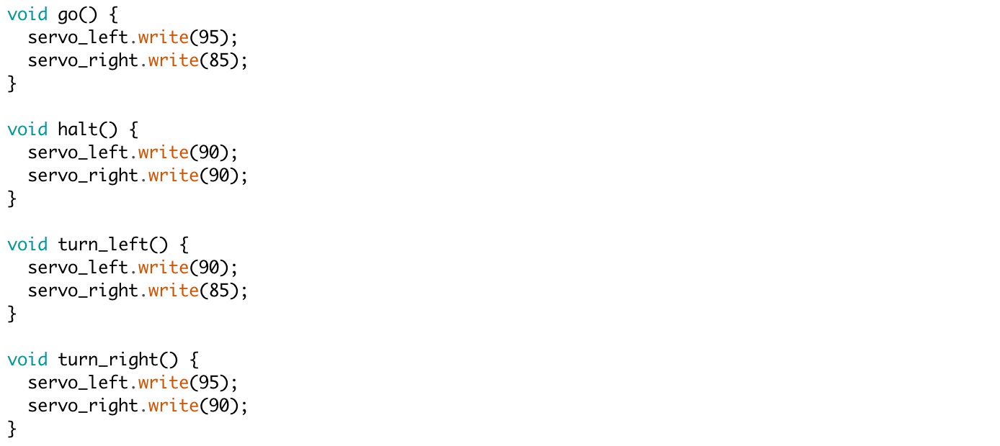
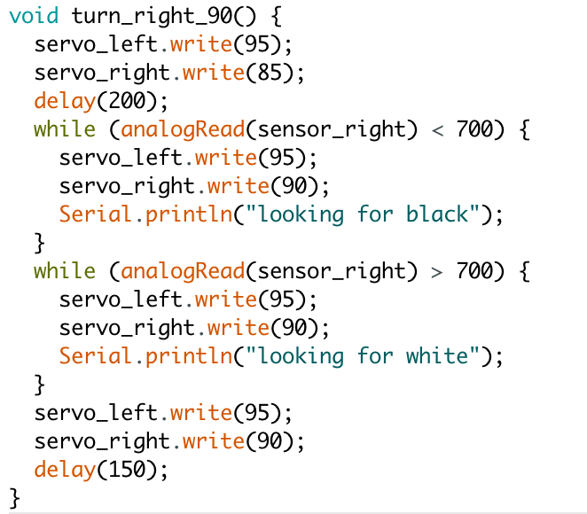
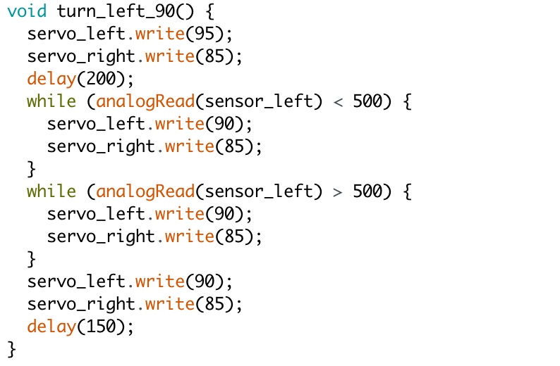

# Introduction

## Setting Up Sensors

To aid the robot in navigating the grid, we used 3 line sensors. The sensors were easy to set up but difficult to calibrate. We spent a long time determining the right distance from the ground the sensors should be so that black and white readings would have a large difference in magnitude. Due to shadows and that not all 3 sensors are the same height of the ground, each of the sensors has a different threshold to determine if it is above white or black. Using the following code, we put the sensors over white and black surfaces and reset the Uno to determine the thresholds without being spammed by constant readings.

## Following Line

To have the robot follow the line, we looped over 5 different cases for the 3 line sensors. The three line sensors are all in a row at the front of the robot. The middle sensor is supposed to be over white and the two outside sensors should be to the left and right of the line. 

The logic behind the implementation is that if the central sensor is on white and the two outside sensors are on black the robot should go straight. If all three sensors are white, then the robot is traversing over a cross in the grid so it should continue to go straight. If the left sensors senses white, then the robot adjusts by turning left. If the right sensors senses white, then the robot adjusts by turning right. The final case is that if all sensors sense black, then the robot stops. This indicates that the robot has reaches the end of the line or that it is completely off the line. The functions for turning left, turning right, moving forward and stopping completely are below.

## Traversing Grid in a Figure 8

To traverse the grid in a figure 8, we used our line following code in addition to new figure 8 logic. For the robot to go in a figure 8, it must make 4 right turns followed by 4 left turns. If all three sensors are over white, then we know we must turn left or right. To keep track of whether to make a left turn or a right turn using the count variable. 

Once we determine which turn to make, we increment or reset count depending on the case, and then tell the robot to either turn left or right 90 degrees. The two implementations of turning right and left 90 degrees are shown below. As our robot turns, the sensor on the side it is turning will initially be over white when it enters the intersection, then black as it turns, and then white again once we have finished our turn. Our implementations tell the robot to turn until it reached white for the second time. 

